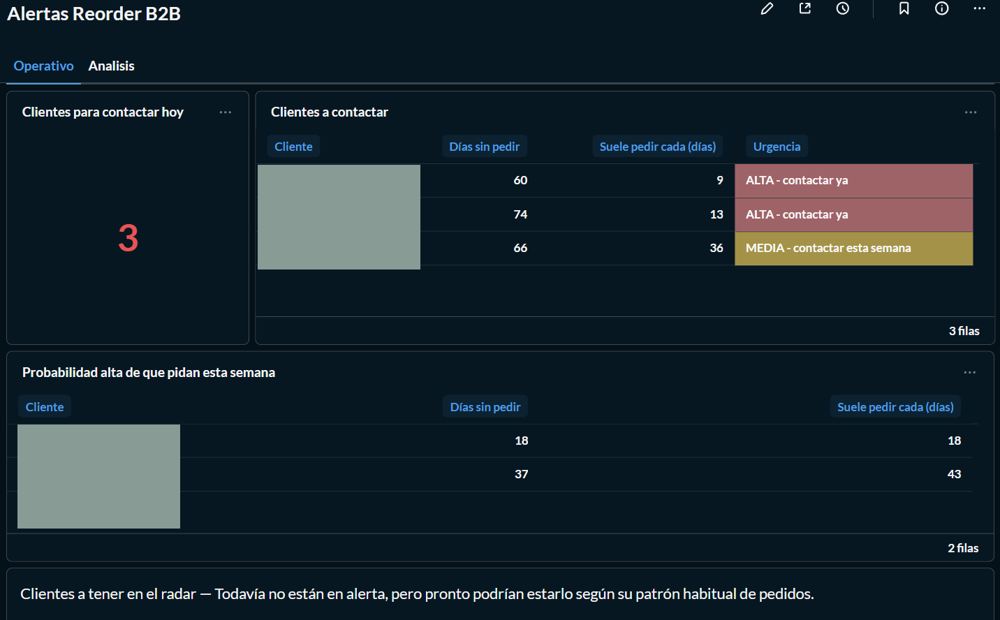
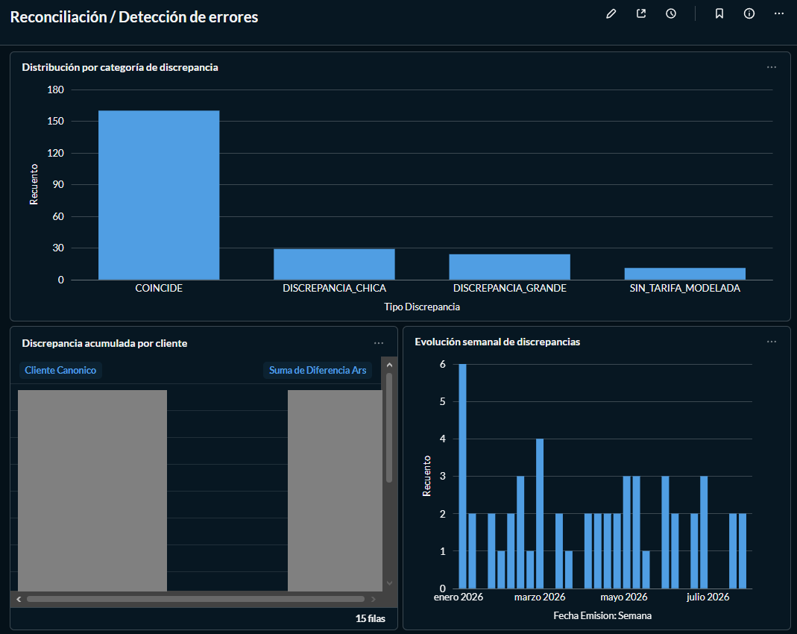
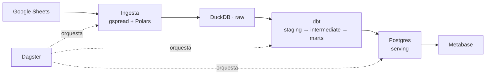
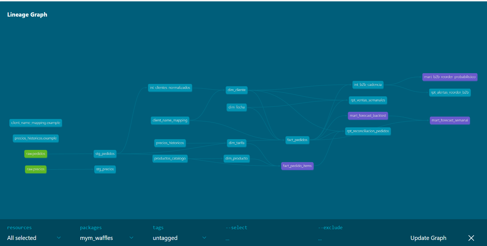
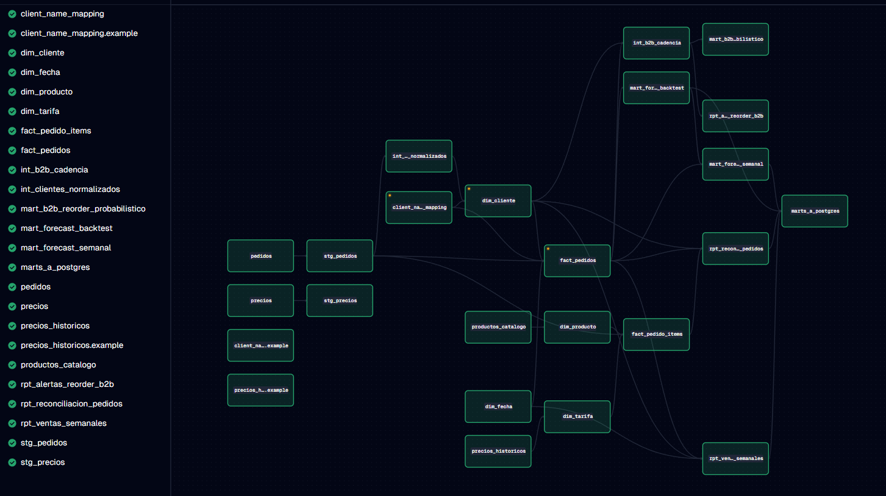

# MyM Waffles — Data Platform

Plataforma de datos que detecta cuándo un cliente mayorista se está atrasando en
su reposición, antes de que el atraso se convierta en un cliente perdido.

Ingesta desde Google Sheets, transformación con dbt sobre DuckDB, orquestación con
Dagster, dashboards en Metabase. Todo local, cero cloud, cero costo.

---

## El problema

MyM Waffles vende waffles congelados a consumidor final y a locales
gastronómicos en el AMBA. Los clientes B2B —cafeterías, bares, heladerías—
reponen con una cadencia propia: uno pide cada dos semanas, otro cada cinco,
otro cuando se le acaba.

Cuando alguno deja de pedir, nadie se entera. No hay un evento que lo avise: el
cliente simplemente no aparece. Para cuando alguien lo nota, pasaron seis
semanas y la conversación ya no es "¿te hago el pedido?" sino "¿por qué dejaste
de comprarnos?".

Los datos para detectarlo existían: cada pedido se cargaba en una Google Sheet.
Pero una planilla no responde "¿quién debería haber pedido esta semana y no
pedió?".



Esa es la pantalla que resuelve el problema. Cruza los días sin pedir de cada
cliente contra su cadencia histórica y devuelve una lista corta y accionable:
a quién llamar hoy.

---

## Casos de uso

**1. Detección de anomalías de reorder B2B.** El dolor real del negocio. Dos capas
complementarias: una regla explicable —días sin pedir contra el intervalo promedio
más un desvío estándar— y un modelo probabilístico que estima, con la CDF normal
sobre la cadencia histórica de cada cliente, la probabilidad de que el reorder ya
haya vencido. Las dos coinciden en los casos claros; el valor está en dónde
divergen.

**2. Forecast semanal de demanda.** Modelo SMA-4 elegido por backtesting con
walk-forward validation, con banda de confianza empírica. Le gana al baseline
naive por 34% de MAE, que fue el criterio explícito adoptado para justificar
cualquier complejidad adicional sobre el baseline.

**3. Reporte semanal de ventas y reconciliación de precios.** Además de la
visibilidad general, compara lo cobrado contra la lista vigente al momento del
pedido —resolviendo la tarifa correcta vía SCD Type 2— y clasifica cada
discrepancia por causa. No es un reporte comercial: es una herramienta de
detección de errores de carga y de bugs del pipeline.



---

## Arquitectura



Modelo dimensional Kimball sobre DuckDB: cuatro dimensiones, dos hechos, siete
marts. El tipado ocurre en staging, no en la ingesta, para que una celda mal
cargada no bloquee las otras doscientas filas.



El pipeline completo está orquestado como assets de Dagster. Los assets Python de
ingesta y los generados desde el manifest de dbt se fusionan por `AssetKey`, así
que el DAG se ve conectado de punta a punta en lugar de partido en dos islas.



Detalle completo en [`docs/arquitectura.md`](docs/arquitectura.md).

---

## Stack

| Capa | Herramienta |
|---|---|
| Ingesta | Python 3.11 + Polars + gspread |
| Warehouse | DuckDB (archivo local) |
| Transformación | dbt-core con adapter duckdb |
| Orquestación | Dagster |
| Serving | Postgres 16 (vía ADBC) |
| Dashboard | Metabase |
| Contenedores | Docker Compose |

Estado del pipeline al cierre:

```
Done. PASS=145 WARN=0 ERROR=0 SKIP=0 TOTAL=145
```

---

## Quickstart

Requisitos: Docker Desktop. Para la ingesta desde Sheets, además una cuenta de
Google Cloud con Sheets API habilitada y un service account con acceso de lectura
a las hojas.

```bash
# 1. Clonar el repo
git clone https://github.com/SabaM10/mym-waffles-data.git
cd mym-waffles-data

# 2. Configurar credenciales
cp .env.example .env
# Editar .env con IDs de Sheets reales y credenciales de Postgres
# Colocar credentials.json en ./secrets/

# 3. Levantar servicios
docker compose up -d

# 4. Materializar assets
docker compose exec dagster dagster asset materialize --select "*"
```

URLs una vez levantado:

- Dagster UI: http://localhost:3000
- Metabase: http://localhost:3001

### Seeds locales

Dos seeds contienen datos sensibles y no se commitean (están en `.gitignore`):
`client_name_mapping.csv` con los nombres reales de clientes, y
`precios_historicos.csv` con la rate card histórica. Se transfieren manualmente
entre entornos por canal privado cifrado.

Para arrancar sin ellos, copiá las versiones de ejemplo:

```bash
cd dbt_project/seeds
cp client_name_mapping.example.csv client_name_mapping.csv
cp precios_historicos.example.csv precios_historicos.csv
```

Tienen estructura idéntica a los reales con datos anonimizados, suficiente para
ejecutar el pipeline completo.

### Documentación de los modelos

```bash
docker compose run --rm dagster bash -c "cd /workspace/dbt_project && dbt docs generate"
docker compose run --rm -p 8080:8080 dagster bash -c "cd /workspace/dbt_project && dbt docs serve --port 8080 --host 0.0.0.0 --no-browser"
```

---

## Estructura del repo

```
.
├── ingestion/                # Extract (Sheets → DuckDB raw) + parsers + forecast
├── dagster_project/          # Assets, schedules, jobs
├── dbt_project/              # Modelos SQL y Python
│   ├── models/staging/
│   ├── models/intermediate/
│   ├── models/marts/
│   ├── seeds/                # productos_catalogo + .example.csv
│   ├── tests/                # Tests SQL custom
│   └── macros/
├── tests/                    # pytest para código Python
├── docs/                     # Documentación técnica y ADRs
│   ├── decisions/            # Un ADR por semana
│   └── img/                  # Capturas de dashboards
├── scripts/                  # One-offs: backfills, utilidades
├── data/                     # Archivo .duckdb (gitignored)
├── secrets/                  # credentials.json (gitignored)
├── docker-compose.yml
├── Dockerfile
├── pyproject.toml
└── README.md
```

---

## Contexto de dominio

MyM Waffles vende waffles congelados en 3 masas (Clásica, Integral, Proteica) con
4 sabores posibles (Dulce, Salado, Neutro, Oreo). Solo 8 combinaciones son SKUs
válidos.

El pricing es una rate card con segmentos y precios por tamaño de pack. Dos reglas
que definen todo el modelo: el tipo de cliente **no** afecta el precio —B2C y B2B
pagan lo mismo, el segmento lo determina la cantidad pedida— y el segmento PROMO
se aplica solo cuando el pedido lo indica explícitamente.

Ver [`docs/pricing.md`](docs/pricing.md) para la rate card y
[`docs/modelo.md`](docs/modelo.md) para el modelo dimensional.

---

## Documentación

| Documento | Contenido |
|---|---|
| [`docs/arquitectura.md`](docs/arquitectura.md) | Stack, capas, decisiones transversales, limitaciones conocidas |
| [`docs/modelo.md`](docs/modelo.md) | Modelo dimensional, grain de cada tabla, casos fuera del modelo |
| [`docs/pricing.md`](docs/pricing.md) | Rate card, SCD Type 2, matching de tarifas, reconciliación |
| [`docs/decisions/`](docs/decisions/) | Un ADR por semana con decisiones, alternativas descartadas y deuda declarada |

Los ADRs registran el proceso, incluidas las exploraciones que se descartaron por
falta de evidencia y los bugs encontrados. Los documentos transversales describen
el resultado.

---

## Estado

Roadmap de 12 semanas, un módulo por semana. Ver [`docs/roadmap.md`](docs/roadmap.md).

- [x] Semana 1: Setup e infraestructura base
- [x] Semana 2: Ingesta raw desde Sheets
- [x] Semana 3: Parsing + normalización
- [x] Semana 4: dbt setup + staging
- [x] Semana 5: Dimensiones + seeds
- [x] Semana 6: Facts + primeras métricas
- [x] Semana 7: Dagster orquestación
- [x] Semana 8: Metabase dashboards
- [x] Semana 9: Forecast semanal
- [x] Semana 10: Análisis B2B (detección de patrones)
- [ ] Semana 11: Backfill 2024-2025 — diferido, ver Roadmap futuro
- [x] Semana 12: Polish + portfolio

---

## Roadmap futuro

### Backfill histórico 2024-2025

El warehouse cubre 2026. La carga del histórico quedó fuera del scope entregado
por una razón de calidad, no de esfuerzo.

El backfill no es el pipeline actual sobre más filas. Requiere un parser tolerante
a convenciones de carga que ya no se usan, una tabla de cuarentena con criterio
de aceptación explícito, versionado de origen en los marts, y —lo más delicado—
reconstrucción de las tarifas históricas por regla inflacionaria.

Ese último punto es el bloqueante. Durante el desarrollo apareció un bug donde el
corte de vigencia de un aumento estaba declarado con una fecha "prolija" de fin de
mes en lugar de la real, generando discrepancias sistemáticas sin trazabilidad. Se
detectó porque existían las planillas originales para validar. Para 2024-2025 no
existen: las tarifas se reconstruirían por regla, sin forma de distinguir un error
de reconstrucción de una anomalía real del negocio.

Incorporar datos con esa incertidumbre contaminaría el forecast y la detección de
reorder, que hoy operan sobre datos verificados.

### Otras extensiones

- Migrar la captura de precios a snapshots de dbt, ahora que la historia base está
  cargada.
- Modelar packs por encima del máximo actual, hoy no reconciliables.
- CI con GitHub Actions ejecutando tests de Python y validación del proyecto dbt
  en cada PR.
- Activar el schedule diario, hoy declarado pero deshabilitado porque el pipeline
  corre en una máquina que no está prendida 24/7.

---

## Fuera de scope

- Análisis de gastos y márgenes.
- Aging de cobranzas.
- Modelos de machine learning para forecast.

---

## Sobre los datos

Los datos son de un negocio real en operación. Los archivos con nombres de
clientes y costos comerciales están gitignored; el repositorio incluye
`.example.csv` con estructura idéntica y datos anonimizados.

Las capturas de dashboards tienen los nombres de clientes difuminados por la
misma razón.

---

## Contexto

Proyecto desarrollado en doce semanas sobre el negocio del que soy co-dueño, lo
que dio acceso directo al conocimiento de dominio: las reglas de pricing, la
interpretación de las anomalías y la validación de cada hallazgo salieron de la
operación real, no de supuestos.

## Licencia

Propietario. Los datos del negocio no están versionados en el repo.
