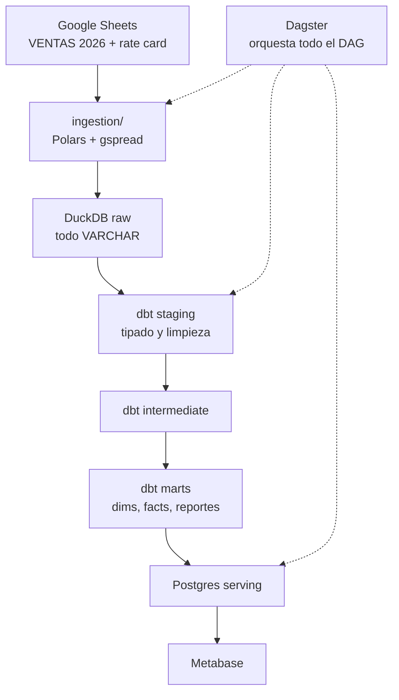

# Arquitectura

Este documento explica **por qué** el sistema está construido así. Las decisiones
semana a semana viven en `docs/decisions/semana-N.md`; el detalle del modelo
dimensional en `modelo.md`; la lógica de precios en `pricing.md`.

---

## 1. Contexto y restricciones

MyM Waffles es un negocio real de waffles congelados que vende a consumidor final
(B2C) y a locales gastronómicos (B2B) en el AMBA. La plataforma de datos se
construyó sobre cuatro restricciones que explican casi todas las decisiones
técnicas que siguen:

| Restricción | Consecuencia |
|---|---|
| La fuente es una Google Sheet cargada a mano | La data sucia es la norma, no la excepción. El pipeline tiene que ser tolerante por diseño. |
| Un solo desarrollador, sin equipo | Se prioriza lo simple de sostener sobre lo canónico. |
| Cero presupuesto de infraestructura | Todo corre local en Docker. Sin cloud, sin servicios pagos. |
| Volumen chico (~220 pedidos/año) | Muchas optimizaciones estándar serían prematuras. |

La cuarta restricción es la más importante y la menos obvia: **el volumen chico
invierte varias buenas prácticas**. Full refresh en lugar de incremental,
materialización `table` en lugar de `incremental`, y lectura completa del sheet en
cada corrida son decisiones correctas acá y equivocadas a otra escala. Están
tomadas a conciencia y documentadas como tales.

---

## 2. Flujo end-to-end

Las capas y su responsabilidad:

| Capa | Schema | Responsabilidad |
|---|---|---|
| Ingesta | `raw` | Leer y guardar. Nada más. |
| Staging | `staging` | Tipar, limpiar, validar sintaxis. 1:1 con la fuente. |
| Intermediate | `intermediate` | Lógica reutilizable que no se consume directo. |
| Marts | `marts` | Modelo dimensional y reportes de negocio. |
| Serving | Postgres | Copia de los marts para consumo BI. |

---

## 3. Decisiones de stack

### DuckDB como warehouse

**Por qué**: motor analítico columnar, embebido en un archivo, sin servidor que
administrar. El dataset entra holgadamente en memoria y las queries analíticas
corren en milisegundos.

**Alternativa descartada**: Postgres como warehouse. Es row-oriented y está
optimizado para transaccional, no para agregaciones sobre columnas. Requiere un
servicio corriendo y administración de usuarios. Para el caso de uso —un
warehouse analítico de una persona— el costo operativo no compra nada.

**Costo asumido**: DuckDB es single-writer. Un notebook con la conexión abierta
bloquea las escrituras de Dagster en Windows. Se convive con eso cerrando la
conexión antes de materializar.

### dbt como capa de transformación

**Por qué**: resuelve nativamente tres problemas que de otro modo hay que
construir a mano — dependencias declaradas con `ref()`, tests declarativos en
YAML, y lineage automático. Es además el estándar de facto de la industria.

**Alternativas descartadas**: SQLMesh y Dataform, ambos con adapters menos maduros
para DuckDB y mucha menos documentación. Scripts SQL sueltos con orden manual: es
exactamente el problema que dbt resuelve.

**Relevancia para auditoría**: dbt produce como subproducto lo que un auditor pide
como evidencia — tests versionados en git, lineage reconstruible, documentación
como código, historial de ejecuciones.

### Polars para la ingesta

**Por qué**: API de tipado estricto, evaluación lazy, e integración nativa con
Arrow, que se aprovecha directamente en la escritura a Postgres vía ADBC.

**Alternativa descartada**: pandas. Funciona, pero su tipado permisivo va en
contra del objetivo de detectar data sucia temprano.

### Dagster como orquestador

**Por qué**: el modelo asset-based encaja conceptualmente con dbt —cada tabla es
un asset con dependencias explícitas— y `dagster-dbt` importa el manifest
generando un asset por modelo automáticamente. El DAG completo queda visible en
una sola UI, desde la ingesta hasta el último mart.

**Alternativas descartadas**: cron, que no da visibilidad, ni retry, ni lineage.
Airflow, cuyo modelo task-based obliga a duplicar el grafo que dbt ya conoce, y
cuyo peso operativo no se justifica para un solo desarrollador.

**Detalle de integración**: los assets Python de ingesta y los sources de dbt
apuntan a las mismas tablas. Sin ajuste, la UI muestra el DAG partido en dos
islas. Se resuelve declarando los assets Python con
`@asset(key_prefix=["raw"], name="pedidos")`, de modo que la `AssetKey` coincida
con la que `dagster-dbt` genera desde `sources.yml` y Dagster las fusione.

### Postgres como capa de serving

**Por qué**: Metabase no tiene driver oficial de DuckDB; el de la comunidad exige
compatibilidad exacta de versiones y es frágil. Se agrega un Postgres al compose
como capa de serving y los marts se exportan ahí vía ADBC al final de cada corrida
de Dagster.

Es una decisión **forzada por una limitación de la herramienta de BI**, no una
preferencia arquitectónica. La ventaja lateral es real: desacopla el warehouse del
consumo, evita que Metabase mantenga abierto el archivo DuckDB, y deja una puerta
abierta a integraciones futuras que ya hablan Postgres.

**Costo asumido**: los marts quedan duplicados en dos motores. El serving es una
copia derivada y desechable; la fuente de verdad siempre es DuckDB.

### Docker Compose para el entorno

Un solo `docker compose up` levanta el stack completo: el container de Dagster
(que también corre dbt y la ingesta), Postgres, y Metabase. Todo el código se
monta en `/workspace`, convención de la que dependen `PYTHONPATH`, `DUCKDB_PATH` y
`DBT_PROFILES_DIR`.

---

## 4. Decisiones transversales de diseño

Tres decisiones atraviesan todas las capas y conviene entenderlas juntas.

### Tipado tardío: `raw` guarda todo como VARCHAR

El casting a tipos correctos ocurre en staging, no en la ingesta.

En desarrollo de aplicaciones el principio es "fallar temprano". En pipelines
analíticos se aplica al revés. Si la ingesta tipa y una celda dice `"48 unidades"`
en vez de `48`, la corrida entera falla y **ninguna** fila se carga, incluidas las
199 que estaban bien. El warehouse queda desactualizado hasta que alguien corrija
el sheet.

Con tipado tardío esa fila llega a `raw` como string, un test de dbt la marca
puntualmente, y las otras 199 siguen fluyendo hacia los marts.

Hay además un beneficio de auditoría: `raw` queda como snapshot literal de lo que
había en la Sheet al momento de la ingesta. La pregunta "¿qué llegó realmente el
15 de agosto?" tiene respuesta exacta.

### Cuarentena en vez de excepción o descarte silencioso

Cuando algo no se puede procesar —un string de pedido que no parsea, un cliente
sin mapping, un producto fuera del catálogo— el sistema no lanza excepción (rompe
el pipeline) ni lo ignora (pierde data sin rastro). Lo marca y lo deja visible.

Se materializa de tres formas distintas según la capa: lista `no_parseados` en el
parser, columna `necesita_mapping` en `dim_cliente`, y categoría
`SIN_TARIFA_MODELADA` en el mart de reconciliación.

Un caso extremo del mismo principio: existe **un test dbt que falla a propósito**.
Un pedido histórico de una masa discontinuada no matchea contra `dim_producto` y
deja `producto_id` en null. En lugar de filtrarlo o debilitar el test, el fail se
documenta y se conserva. Cada `dbt test` recuerda que hay un caso conocido de
producto descatalogado. Filtrar ocultaría la información; el test rojo la mantiene
viva.

### Full refresh en toda la ingesta

Cada corrida borra y recarga las tablas de `raw`, agregando una columna técnica
`ingested_at`.

Con ~2.400 filas totales, la API de Sheets las devuelve en segundos. Implementar
carga incremental —tracking de hashes, manejo de deletions, testing de casos
borde— cuesta órdenes de magnitud más que releer todo. Es optimización prematura
de manual.

Ventaja lateral: el full refresh es idempotente por definición. Correr la ingesta
dos veces seguidas produce exactamente el mismo estado.

---

## 5. Modelo de despliegue

| Servicio | Puerto | Rol |
|---|---|---|
| `dagster` | 3000 | Orquestación, ingesta Python, ejecución de dbt |
| `postgres` | 5432 | Capa de serving |
| `metabase` | 3001 | Dashboards |

Configuración por variables de entorno. `.env.example` documenta las doce que el
código consume; `.env` real está gitignored.

**Convenciones que no son negociables**:

- `DUCKDB_PATH` debe ser **absoluta**. `dagster-dbt` hace `cd` al directorio del
  proyecto dbt antes de invocar dbt, y una path relativa se resuelve contra un CWD
  distinto al esperado.
- `PYTHONPATH=/workspace` va en `docker-compose.yml`, **no** en `.env`. Los
  modelos Python de dbt se ejecutan desde `/tmp` y necesitan encontrar el paquete
  `ingestion`. En `.env` (gitignored) el fix se pierde al migrar de máquina —
  ya pasó una vez.

Regla general derivada de las dos: **la configuración requerida para que el
pipeline funcione va versionada; solo los secretos van en `.env`**.

---

## 6. Limitaciones conocidas

Ninguna de estas es un descuido. Todas son trade-offs asumidos.

- **Sin carga incremental.** Full refresh en toda la ingesta. Se reevalúa si el
  volumen crece un orden de magnitud.
- **Single-node, sin alta disponibilidad.** El pipeline corre en una notebook con
  Docker Desktop.
- **Schedule diario declarado pero deshabilitado.** La máquina no está prendida
  24/7, así que los ticks caerían en el vacío. El schedule queda en código como
  documentación ejecutable: activarlo en un server es un toggle, no un desarrollo.
  Antes de activarlo hay que fijar `execution_timezone` (hoy interpreta UTC).
- **`POSTGRES_PASSWORD` tiene default de desarrollo.** Si la variable no está
  seteada, el stack levanta con una password débil en lugar de fallar. Aceptable
  en local; en un despliegue real el default debería removerse para que la
  ausencia de la variable sea un error ruidoso.
- **Sin CI de datos.** Los tests de dbt corren en cada materialización de Dagster,
  pero no hay gate automático en cada push.
- **Un test dbt en rojo permanente**, documentado arriba y en el ADR de semana 6.
- **Sin backfill histórico.** El warehouse cubre 2026. La carga de 2024-2025 está
  diferida; el razonamiento está en el README bajo "Roadmap futuro".

---

## Referencias

- Modelo dimensional: `modelo.md`
- Lógica de precios y reconciliación: `pricing.md`
- Decisiones semana a semana: `docs/decisions/`
